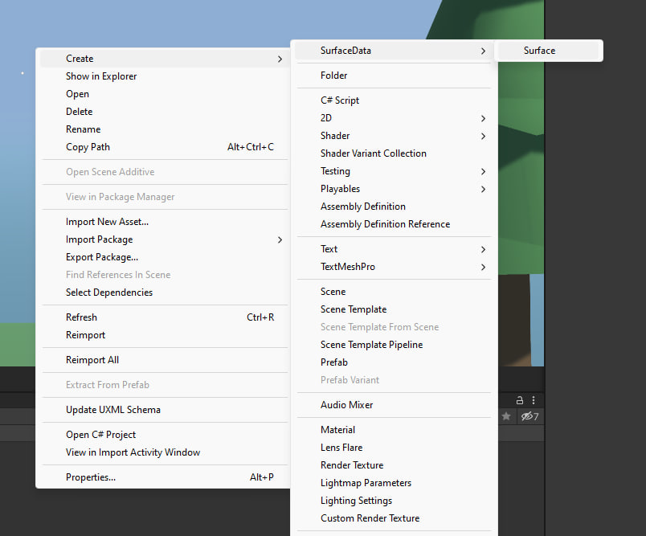
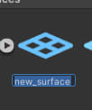
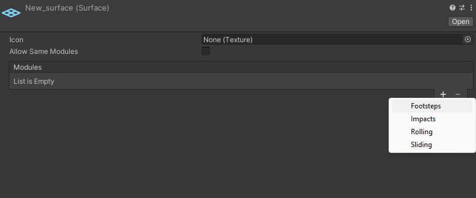
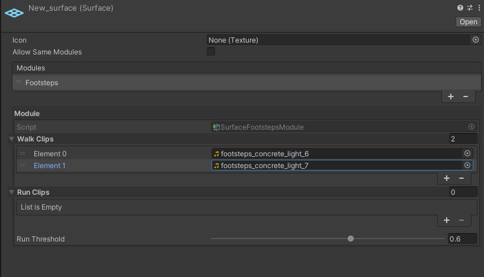
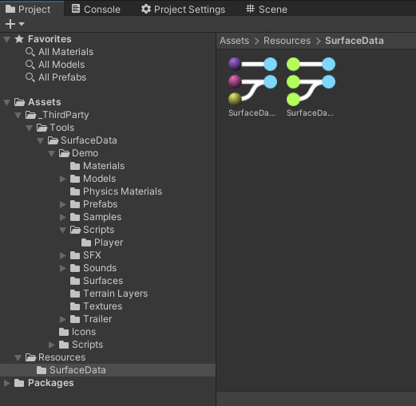
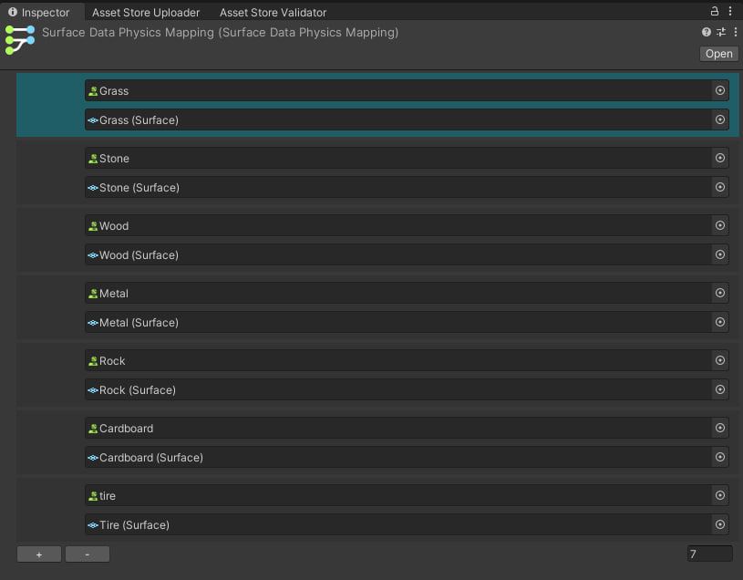
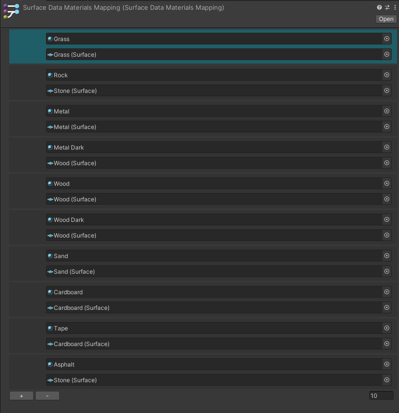
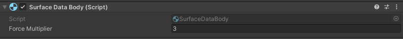

# Tutorial

Let's discover **Surface Data in less than 5 minutes**.

## Getting Started

### Creating Surfaces

Get started by creating new **surface**:



Now we can call it whatever we want:



After that we need to add modules to our surface:



*you can write your own modules

Let's add **Footsteps module**, for example. This module contains **Walk Clips**, **Run Clips** and **Run Threshold** to configure.



Your first **surface** is ready to go!

### Mapping Configuration

You can see at **Resources** folder automatic generated files: **SurfaceDataMaterialsMapping** and **SurfaceDataPhysicsMapping**. This is mapping managers, that will help you to connection between the game and the **surfaces**.



To get surface from **Collision** or **RaycastHit** you should use:

```csharp
SurfaceData.TryGetSurface( RaycastHit hit, out Surface surface );
// or
SurfaceData.TryGetSurface( ContactPoint contactPoint, out Surface surface, bool reversed = false ) // contactPoint from collision
```

### Physics Materials Mapping

This manager help to create connection between **Physics Materials** and **Surfaces**. Just click on **"+"** button and link desired **Physics Material** with **Surface**.



*also this window supports icons from **Surface**


### Render Materials Mapping

This manager help to create connection between **Material** and **Surface**. Flow the same as with **Physics Materials Mapping**



*also this window supports icons from **Material** texture


## How to use it?

### SurfaceDataBody

You can use Surfaces as you want, but for example we have SurfaceDataBody, which can be used for any Rigidbody object. Just put it on your object with Rigidbody and it is ready to go!



In some cases you need to adjust **Force Multiplier** to get expected result. For example, increase value, to get sound more loud.

### Extensions

I wrote some extension to make tool easy to use.

```csharp
RaycastHit.PlayFootstep( this RaycastHit hit, float strength = 1 );

Collision.PlayImpact( this Collision collision, CollisionMode collisionMode, float forceMultiplier = 1 )
Collision.ToRaycastHit( this Collision collision, bool reversed = false );

ContactPoint.ToRaycastHit( this ContactPoint contactPoint, bool reversed = false );


SurfaceData.TryGetSurface( RaycastHit hit, out Surface surface );
SurfaceData.TryGetSurface( ContactPoint contactPoint, out Surface surface, bool reversed = false ) // contactPoint from collision

Surface.TryGetModule( out T module ) // where T is expected module

AudioSourcesPool.GetAudioSource();
```